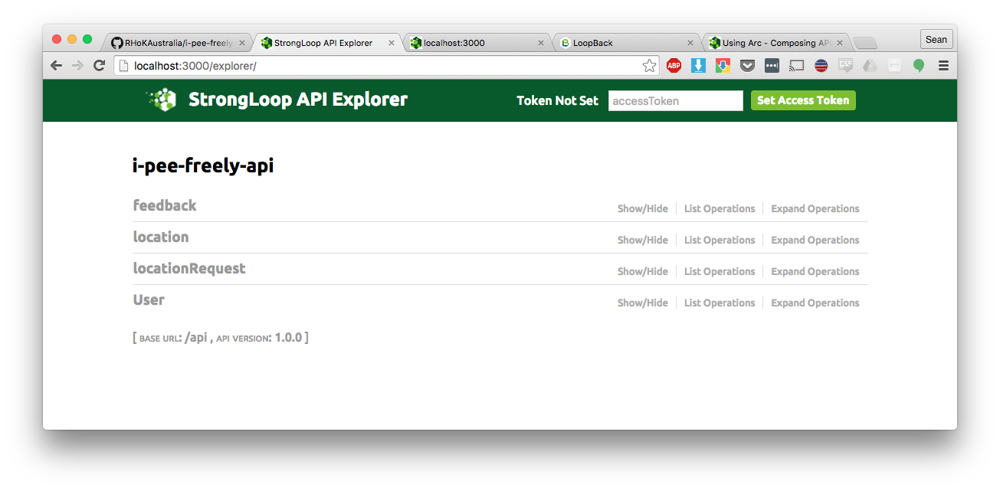

# I.PEE.FREELY API

The API is written using [LoopBack](https://loopback.io/) which means you can edit the API using a graphical interface using StrongLoop Arc. This makes it easy to get things prototyped really quickly.

We spent a lot of time getting the schema designed at the last hackathon so it would at least be a good starting point to checkout the current schema using Arc.

You can find out how to use Arc to edit the API here:
https://docs.strongloop.com/display/APIS/Using+Arc

Once you start the server you can explore the API and send test requests using the built in explorer at `http://localhost:3000/explorer`



'i-pee-freely-api/client' has a set of HTML files that connect to the API to do stuff such as post feedback. It is all hardcoded to a specific IP so you should change it to localhost or whatever IP the API is on.


### Dependencies
Make sure the npm strongloop package is installed like this:

```
$ npm install -g strongloop
```

Originally it was set up to connect to a MySQL database.

If you want to take it for a spin without a database you can change the "mySQL-Wordpress" entry in 'i-pee-freely-api/server/datasources.json' to a memory database temporarily. I don't know how well it will work but it will at least allow you to start the server. Change the entry to this to get it to use a memory db.

```
  "mySQL-Wordpress": {
    "name": "db",
    "connector": "memory"
  }
```

If you spin up a MySQL database, Strongloop should be able to write the schema to the database for you through Arc.

You can populate it with some data under the 'scripts/datadump.sql'. This will save you some time because we originally had to scrape that from an excel spreadsheet. 
After you do that you can edit the JSON file at 'i-pee-freely-api/server/datasource.json' to point to your MySQL server.


### How do I start the API server?
Just run 'npm start' from the 'i-pee-freely' subdirectory.

```
$ cd i-pee-freely-api
$ npm start

```

### How do I start Strongloop Arc?
```
$ cd i-pee-freely-api
$ slc arc

```

### Why is the directory structure so weird?
I'm not sure why the the repo directory is called 'i-pee-freely-api` and it contains another directory called 'i-pee-freely-api', all I know is that you should be spending most of your time in the subdirectory because that is were all the API files are and `npm start` and `slc arc` will work.

